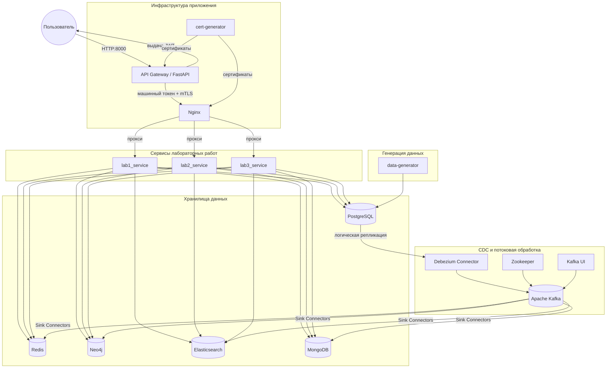

# Микросервисный пайплайн обработки данных учебного заведения

Данный проект реализует потоковую обработку данных университетской системы с использованием CDC (Change Data Capture) и синхронизацией изменений из реляционной базы данных PostgreSQL в нереляционные: Neo4j, MongoDB, Elasticsearch и Redis.

## Архитектура приложения

## Клиентская часть и шлюз

API Gateway реализован в контейнере `gateway` на **FastAPI**, который:
*   Принимает HTTPS-запросы на порт `8000`.
*   Реализует **JWT-аутентификацию**.
*   Маршрутизирует запросы к внутренним сервисам лабораторных работ.

Сервисы лабораторных работ (`lab1_service`, `lab2_service`, `lab3_service`) изолированы в общей сети Docker. Nginx выступает в роли обратного прокси с mTLS. Генерация сертификатов выполняется в отдельном контейнере `cert-generator` и монтируется в `gateway` и `nginx`.

## Базы данных и CDC

- **Источник данных**: PostgreSQL (информация по университетам: иерархия, лекции, списки студентов и т.д. - заполняется автоматически скриптом контейнера `data-generator` при поднятии всех контейнеров)
- **CDC**: Debezium PostgreSQL Connector
- **Потоковая платформа**: Apache Kafka
- **Целевые системы CDC**:
  - Redis – кэш студентов в виде строк JSON с ключом `student:<student_card_number>`
  - Neo4j – графовая модель связей `студент-группа-расписание-лекция`
  - MongoDB – денормализованная иерархия `университет-институт-кафедра-специальность` (один документ - один университет)
  - Elasticsearch – полнотекстовый поиск по материалам лекций

## Используемые коннекторы и обработчики

### 1. Neo4j Sink Connector
- **Версия**: 5.3.1
- **Репозиторий**: [neo4j/neo4j-kafka-connector](https://github.com/neo4j/neo4j-kafka-connector/releases)
- **Назначение**: синхронизация узлов студент, группа, расписание, лекция и связей между ними в графовую базу.

### 2. MongoDB Sink Connector
- **Версия**: 1.8.0
- **Репозиторий**: [mongodb/mongo-kafka](https://github.com/mongodb/mongo-kafka)
- **Назначение**: при помощи кастомного обработчика `UniversityCdcHandler` собирает изменения из таблиц university, institute, department, specialty, department_specialties в единый документ университета.

### 3. Elasticsearch Sink Connector
- **Версия**: 10.0.5
- **Репозиторий**: [Lenses Stream Reactor](https://github.com/lensesio/stream-reactor/releases)
- **Назначение**: синхронизация материалов лекций, удаление фиксируется при помощи кастомного обработчика `LectureMaterialCdcHandler`

### 4. Redis Sink Connector
- **Версия**: 10.0.5
- **Репозиторий**: [Lenses Stream Reactor](https://github.com/lensesio/stream-reactor/releases)
- **Назначение**: кеширует данные по студентам, удаление фиксируется при помощи кастомного обработчика `DeletingCdcHandler`

## Развёртывание и запуск системы

1) Создайте директорию проекта `sinks/jars/` и переместите в неё jar-файлы коннекторов из указанных репозиторий

2) Скомпилируйте кастомные обработчики коннекторов при помощи команд, указанных в файле `Подсказки/команды проверки CDC.txt`

3) Настройте пути хранения volumes, а также номера внешних портов контейнеров в `docker-compose.yaml`

4) Запустите систему командой: `docker-compose up -d`

---

*Дополнительные команды по проверке работоспособности CDC и контейнеров приложения указаны в корневой директории `Подсказки`.*

*Дополнительные схемы по архитектуре приложения и расположения данных в БД указаны в корневой директории `Схемы`.*

