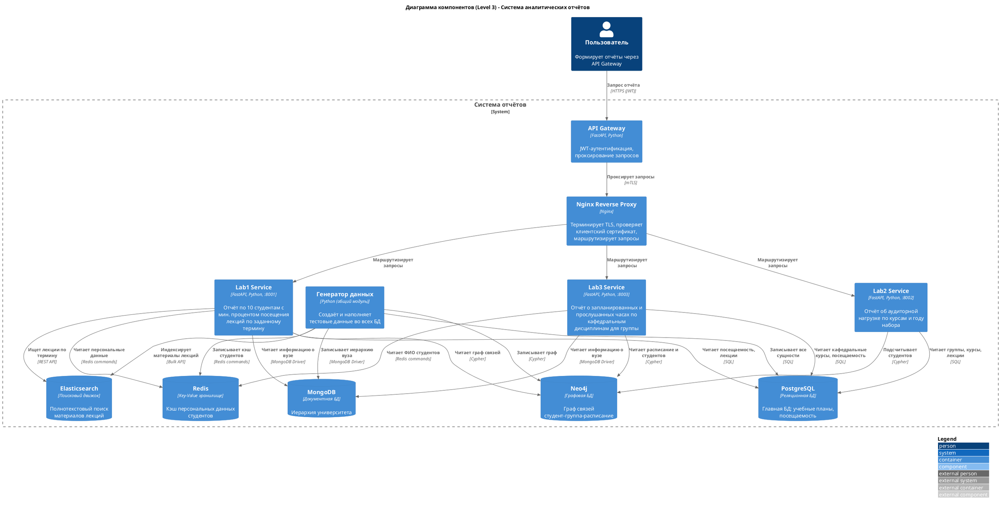

```plantuml
@startuml C4_Components
!include <C4/C4_Component>

LAYOUT_WITH_LEGEND()

title Диаграмма компонентов (Level 3) - Система аналитических отчётов

' Компоненты внутри контейнера "Система отчётов"
System_Boundary(report_system, "Система отчётов") {
    Container(gateway, "API Gateway", "FastAPI, Python", "JWT-аутентификация, проксирование запросов")
    Container(nginx, "Nginx Reverse Proxy", "Nginx", "Терминирует TLS, проверяет клиентский сертификат, маршрутизирует запросы")
    Container(lab1, "Lab1 Service", "FastAPI, Python, :8001", "Отчёт по 10 студентам с мин. процентом посещения лекций по заданному термину")
    Container(lab2, "Lab2 Service", "FastAPI, Python, :8002", "Отчёт об аудиторной нагрузке по курсам и году набора")
    Container(lab3, "Lab3 Service", "FastAPI, Python, :8003", "Отчёт о запланированных и прослушанных часах по кафедральным дисциплинам для группы")
    Container(generator, "Генератор данных", "Python (общий модуль)", "Создаёт и наполняет тестовые данные во всех БД")

    ContainerDb(pg, "PostgreSQL", "Реляционная БД", "Главная БД: учебные планы, посещаемость")
    ContainerDb(redis, "Redis", "Key-Value хранилище", "Кэш персональных данных студентов")
    ContainerDb(mongo, "MongoDB", "Документная БД", "Иерархия университета")
    ContainerDb(neo4j, "Neo4j", "Графовая БД", "Граф связей студент-группа-расписание")
    ContainerDb(es, "Elasticsearch", "Поисковый движок", "Полнотекстовый поиск материалов лекций")
}

Person(user, "Пользователь", "Формирует отчёты через API Gateway")

Rel(user, gateway, "Запрос отчёта", "HTTPS (JWT)")
Rel(gateway, nginx, "Проксирует запросы", "mTLS")
Rel(nginx, lab1, "Маршрутизирует запросы")
Rel(nginx, lab2, "Маршрутизирует запросы")
Rel(nginx, lab3, "Маршрутизирует запросы")

Rel(generator, pg, "Записывает все сущности", "SQL")
Rel(generator, redis, "Записывает кэш студентов", "Redis commands")
Rel(generator, mongo, "Записывает иерархию вуза", "MongoDB Driver")
Rel(generator, neo4j, "Записывает граф", "Cypher")
Rel(generator, es, "Индексирует материалы лекций", "Bulk API")

Rel(lab1, pg, "Читает посещаемость, лекции", "SQL")
Rel(lab1, redis, "Читает персональные данные", "Redis commands")
Rel(lab1, mongo, "Читает информацию о вузе", "MongoDB Driver")
Rel(lab1, neo4j, "Читает граф связей", "Cypher")
Rel(lab1, es, "Ищет лекции по термину", "REST API")

Rel(lab2, pg, "Читает группы, курсы, лекции", "SQL")
Rel(lab2, neo4j, "Подсчитывает студентов", "Cypher")

Rel(lab3, pg, "Читает кафедральные курсы, посещаемость", "SQL")
Rel(lab3, neo4j, "Читает расписание и студентов", "Cypher")
Rel(lab3, redis, "Читает ФИО студентов", "Redis commands")
Rel(lab3, mongo, "Читает информацию о вузе", "MongoDB Driver")

@enduml
```