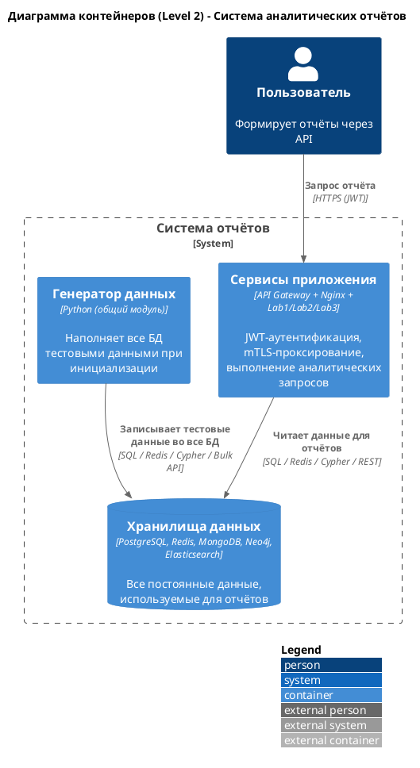

```plantuml
@startuml C4_Containers
!include <C4/C4_Container>

LAYOUT_WITH_LEGEND()

title Диаграмма контейнеров (Level 2) - Система аналитических отчётов

Person(user, "Пользователь", "Формирует отчёты через API")

System_Boundary(report_system, "Система отчётов") {
    Container(app_services, "Сервисы приложения", "API Gateway + Nginx + Lab1/Lab2/Lab3", "JWT-аутентификация, mTLS-проксирование, выполнение аналитических запросов")
    Container(generator, "Генератор данных", "Python (общий модуль)", "Наполняет все БД тестовыми данными при инициализации")
    ContainerDb(data_stores, "Хранилища данных", "PostgreSQL, Redis, MongoDB, Neo4j, Elasticsearch", "Все постоянные данные, используемые для отчётов")
}

Rel(user, app_services, "Запрос отчёта", "HTTPS (JWT)")
Rel(app_services, data_stores, "Читает данные для отчётов", "SQL / Redis / Cypher / REST")
Rel(generator, data_stores, "Записывает тестовые данные во все БД", "SQL / Redis / Cypher / Bulk API")

@enduml
```