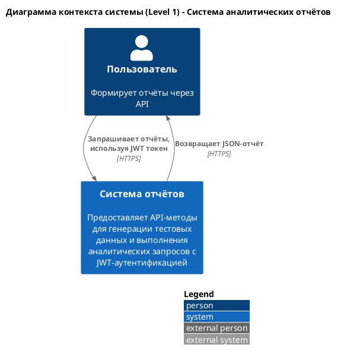

```plantuml
@startuml C4_Context
!include <C4/C4_Context>

LAYOUT_WITH_LEGEND()

title Диаграмма контекста системы (Level 1) - Система аналитических отчётов

Person(user, "Пользователь", "Формирует отчёты через API")

System(report_system, "Система отчётов", "Предоставляет API-методы для генерации тестовых данных и выполнения аналитических запросов с JWT-аутентификацией")

Rel(user, report_system, "Запрашивает отчёты, используя JWT токен", "HTTPS")
Rel(report_system, user, "Возвращает JSON-отчёт", "HTTPS")

@enduml
```