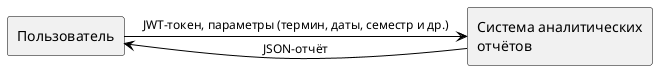

```plantuml
@startuml DFD_Level0_Final
' Нотация Йордана-Кода (уровень 0):
' внешняя сущность - прямоугольник
' процесс - скруглённый прямоугольник с номером
' хранилища на этом уровне не показываются

skinparam rectangle {
    BorderColor #000000
    FontSize 14
}
skinparam rectangle<<rounded>> {
    BorderColor #000000
    BackgroundColor #FFFFFF
    FontSize 14
    BorderRadius 15
}
skinparam arrow {
    Color #000000
    FontSize 12
}

' Внешняя сущность
rectangle "Пользователь" as User

' Процесс (вся система как единый процесс)
rectangle "Система аналитических\nотчётов" as System

' Потоки данных
User -right-> System : JWT-токен, параметры (термин, даты, семестр и др.)
System -left-> User : JSON-отчёт
@enduml
```