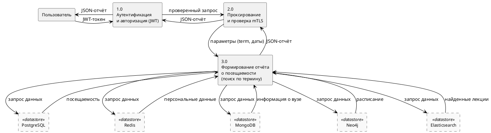

```plantuml
@startuml DFD_Level1_Final
' Нотация Йордана-Кода:
' внешняя сущность - прямоугольник
' процессы - скруглённые прямоугольники с порядковыми номерами
' хранилища данных - открытые прямоугольники (пунктирная граница, без правой стороны)

skinparam rectangle {
    BorderColor #000000
    FontSize 12
}
skinparam rectangle<<rounded>> {
    BorderColor #000000
    BackgroundColor #FFFFFF
    FontSize 12
    BorderRadius 15
}
skinparam rectangle<<datastore>> {
    BorderStyle dashed
    BackgroundColor #F9F9F9
    BorderColor #000000
}
skinparam arrow {
    Color #000000
}

' Внешняя сущность
rectangle "Пользователь" as User

' Процессы (скруглённые прямоугольники)
rectangle "1.0\nАутентификация\nи авторизация (JWT)" as Auth
rectangle "2.0\nПроксирование\nи проверка mTLS" as Proxy
rectangle "3.0\nФормирование отчёта\nо посещаемости\n(поиск по термину)" as Report1

' Хранилища данных (открытые прямоугольники)
rectangle "PostgreSQL" as PG <<datastore>>
rectangle "Redis" as Redis <<datastore>>
rectangle "MongoDB" as Mongo <<datastore>>
rectangle "Neo4j" as Neo4j <<datastore>>
rectangle "Elasticsearch" as ES <<datastore>>

' ===== Прямые потоки (запросы) =====
User -right-> Auth : JWT-токен
Auth -right-> Proxy : проверенный запрос
Proxy -down-> Report1 : параметры (term, даты)

' ===== Чтение данных (из хранилищ в процессы) =====
Report1 -down-> PG : запрос данных
PG -up-> Report1 : посещаемость
Report1 -down-> Redis : запрос данных
Redis -up-> Report1 : персональные данные
Report1 -down-> Mongo : запрос данных
Mongo -up-> Report1 : информация о вузе
Report1 -down-> Neo4j : запрос данных
Neo4j -up-> Report1 : расписание
Report1 -down-> ES : запрос данных
ES -up-> Report1 : найденные лекции

' ===== Обратные потоки (ответы) =====
Report1 -up-> Proxy : JSON-отчёт
Proxy -left-> Auth : JSON-отчёт
Auth -left-> User : JSON-отчёт
@enduml
```